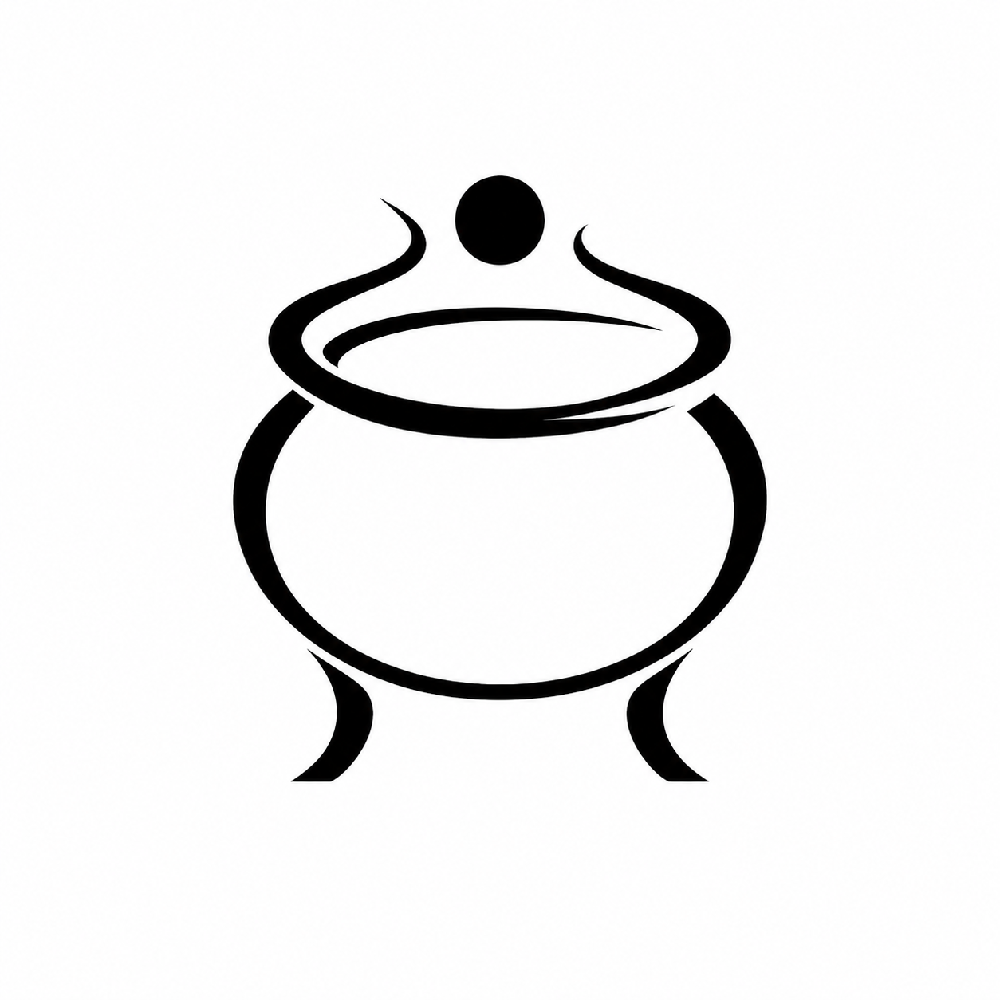

<div align="center">
  

  <h1>Alchemy Furnace · 炼丹炉</h1>

  <p>Give agents a vivid sense of personhood.</p>

  <p>
    <a href="#why-alchemy-furnace">Why Alchemy Furnace</a> ·
    <a href="#what-it-does">What it does</a> ·
    <a href="#get-started">Get started</a> ·
    <a href="#local-development">Development</a>
  </p>

  <p><a href="README.zh.md">中文</a> · <a href="https://github.com/yusanwen-code/alchemy-furnace">GitHub</a></p>
</div>

---

## Why Alchemy Furnace

Most agents can complete a task. Far fewer make you feel that there is **someone** on the other side.

Alchemy Furnace explores more than a static character sheet. How can an agent develop recognisable habits of expression, values, knowledge preferences, emotional cadence, and ways of relating? When two—or several—very different personalities are fused, what new individual emerges: one that inherits its sources, but cannot be reduced to their sum?

“A sense of personhood” is not imitation, and it is not a handful of personality labels. It comes from reusable, adjustable language patterns that remain visible across conversations: someone precise and restrained; someone warm, energetic, and relentlessly curious; someone who turns disorder into structure. Alchemy Furnace distils those patterns into composable **Elixir Pills**, which **Dao Agents** can take, collide with, and grow through.

> The question is not whether an agent can resemble a person. It is: when different people meet and influence one another, who might they become?

## What it does

- **Distil language patterns** — Turn a way of speaking, a skill tendency, or a personality trait into a structured Elixir Pill. Write one by hand or use Nuwa Distillation to extract a reviewable draft from source material.
- **Shape Dao Agents** — Give an agent a name, profile, avatar, base personality, model, and pill bindings, then build a conversational identity that can keep evolving.
- **Fuse personalities** — Use weights and order to let multiple pills interact. Fusion is not just joining settings; it is a way to observe how traits coordinate, conflict, and produce something emergent.
- **Talk and hold roundtables** — Develop a one-to-one relationship with an agent, or bring several together around a topic to see their different voices and dynamics.
- **Keep synthesis traceable** — Pills, bindings, and fusion origins are recorded. Go orchestrates and caches; the Python engine performs structured synthesis and OpenAI-compatible model calls.

## Core concepts

| Concept | Meaning |
| --- | --- |
| **Elixir Pill** (金丹) | A structured recipe for a language pattern or capability: an expressive style, a thinking habit, a knowledge preference, or a personality tendency. |
| **Dao Agent** (道人) | An AI conversational individual with a base personality, identity, model, and pill bindings. |
| **Binding** (服丹) | Attaches a pill to an agent and tunes its influence with `weight` (0–10) and `sort_order`. |
| **Synthesis** (合成) | Refines an agent’s base nature and bound pills into the system prompt and behavioural rules used in conversation. |
| **Fusion Pill** (融合金丹) | A new pill distilled from several pills, retaining its source and version history. |

## How it works

```text
Your material, observations, and ideas
                 │
                 ▼
      Distil Elixir Pills ──→ Fuse new possibilities
                 │                       │
                 ▼                       ▼
          Agents take pills ───────→ A distinct personality
                 │
                 ▼
     Conversations / roundtables / observation
```

Alchemy Furnace is a **Wails desktop application**. It runs a Go gateway, Python language engine, and static Next.js UI locally; data is stored in a SQLite file in the user configuration directory by default. Model calls use the OpenAI-compatible endpoint configured in Settings.

## Get started

Download the desktop package for your platform from [GitHub Releases](https://github.com/yusanwen-code/alchemy-furnace/releases):

- macOS Apple Silicon (`darwin-arm64`)
- macOS Intel (`darwin-amd64`)
- Windows x64 (`windows-amd64`)

After launch:

1. Configure a model provider, API key, base URL, and default model in **Settings**.
2. Create or distil an Elixir Pill in the **Elixir Pavilion**.
3. Create a Dao Agent and choose its base personality and pills in the **Daoist Residence**.
4. Start a dialogue or invite several agents to a roundtable in **Discourse**.

API keys are encrypted in the local database. Do not commit `.env`, exported configurations, or logs.

## Local development

### Requirements

- Go (see `backend/go/go.mod`)
- Python 3.11+ and `pip`
- Node.js 20+ and `pnpm`
- Docker Desktop, only when using PostgreSQL or the full Compose development stack

### Quick start

```bash
make init                 # create .env for development/self-hosting
make dev                  # start frontend, Go, Python, and check the database
```

Run services individually when needed:

```bash
make dev-front
make dev-go
make dev-python
```

### Tests, formatting, and desktop packaging

```bash
make test
make format
make desktop-package PLATFORM=darwin-arm64 VERSION=v0.1.0
# PLATFORM: darwin-arm64, darwin-amd64, or windows-amd64
```

The desktop package is the supported product form. The Web UI, `serve` command, and Docker Compose remain available for development, diagnostics, and CI; they are not a separately supported Web or mobile product.

## Repository layout

```text
backend/go/       Go API gateway, Wails entry point, data access, and services
backend/python/   FastAPI language engine, distillation, and LLM calls
frontend/         Next.js + React + Tailwind desktop UI
scripts/          Development, runtime build, desktop packaging, and checks
docs/             Architecture, deployment, operations, and design docs
specs/            Feature specifications and data contracts
```

## Further reading

- [System architecture](docs/architecture.md)
- [Desktop release process](docs/deployment/desktop-release.md)
- [Frontend notes](docs/frontend.md)
- [中文 README](README.zh.md)

## License

This project uses the repository’s [custom license](LICENSE). Personal, educational, and non-commercial use is allowed by default; commercial use requires the author’s prior written approval.

© yusanwen-code · Alchemy Furnace
